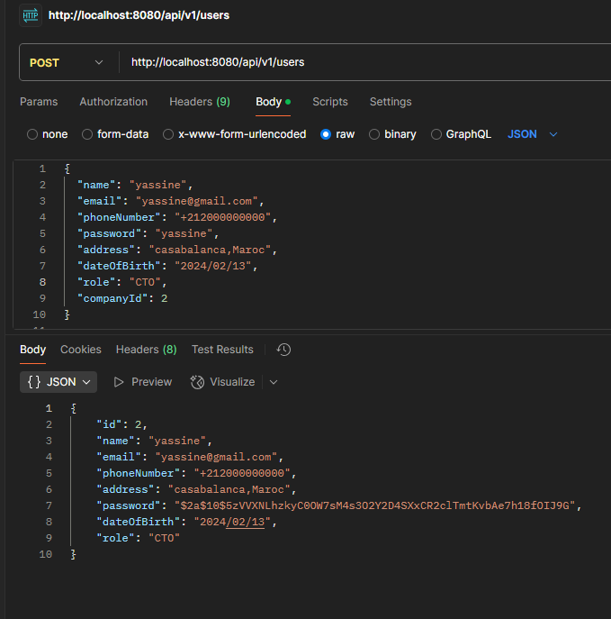

# Documentation Technique API REST Spring Boot

## Architecture et Implémentation 

### 1. Configuration du Cache (`CacheConfig`)
- Utilisation de `@EnableCaching` pour activer la mise en cache
- Implémentation d'un `SimpleCacheManager` avec deux caches en mémoire :
    - Cache "users" pour les utilisateurs
    - Cache "companies" pour les entreprises

### 2. Modèle de Données

#### DTOs (Data Transfer Objects)
- **CompanyRequestDto**
    - DTO d'entrée pour les entreprises
    - Validation des données avec formatage de date (pattern "yyyy/MM/dd")
    - Utilisation de Lombok pour réduire le boilerplate

- **CompanyResponseDto**
    - DTO de sortie incluant la liste des utilisateurs associés
    - Gestion bidirectionnelle de la relation company-users

- **UserRequestDto/UserResponseDto**
    - Séparation claire des données d'entrée/sortie
    - Gestion des rôles via enum
    - Sécurisation des mots de passe

#### Entités
- **Company**
    - Relation OneToMany avec User
    - Gestion de la cascade et du chargement lazy
    - Identifiant auto-généré

- **User**
    - Relation ManyToOne avec Company
    - Gestion des rôles via enum
    - Hashage des mots de passe avec BCrypt

### 3. Gestion des Exceptions
Architecture robuste avec 4 types d'exceptions :
1. **BusinessException** : Erreurs métier (409 Conflict)
2. **NotFoundException** : Ressources non trouvées (404 Not Found)
3. **ValidationException** : Erreurs de validation (400 Bad Request)
4. **GlobalExceptionHandler** : Gestion centralisée des exceptions

### 4. Services Métier

#### CompanyService
Implémentation des opérations CRUD avec :
- Validation des données uniques (nom, email)
- Gestion des relations bidirectionnelles
- Mise en cache des opérations
- Gestion des contraintes métier

```java
@CachePut(value = "companies", key = "#result.idCompany")
@CacheEvict(value = "companies", key = "#id")
@Cacheable(value = "companies")
```
#### UserService
- Gestion sécurisée des mots de passe avec BCrypt
- Validation des contraintes métier
- Gestion des relations avec les entreprises
- Cache optimisé pour les opérations fréquentes

### 5. Mappers (MapStruct)
- **CompanyRequestMapper/ResponseMapper**
    - Conversion DTO ↔ Entity
    - Gestion des relations bidirectionnelles
    - Ignorance sélective des champs

- **UserRequestMapper/ResponseMapper**
    - Mapping intelligent des relations
    - Conversion des types complexes

### 6. API REST (Controller)
Endpoints exposés :

#### Companies
```
POST   /api/v1/companies       - Création
PUT    /api/v1/companies/{id}  - Mise à jour
GET    /api/v1/companies/{id}  - Récupération par ID
GET    /api/v1/companies       - Liste complète
DELETE /api/v1/companies/{id}  - Suppression
```

#### Users
```
POST   /api/v1/users          - Création
PUT    /api/v1/users/{id}     - Mise à jour
GET    /api/v1/users/{id}     - Récupération par ID
GET    /api/v1/users          - Liste complète
DELETE /api/v1/users/{id}     - Suppression
```

### 7. Points Forts de l'Implémentation

1. **Sécurité**
    - Hashage des mots de passe
    - Validation des données
    - Gestion des accès concurrents

2. **Performance**
    - Mise en cache optimisée
    - Chargement lazy des relations
    - Transactions bien gérées

3. **Maintenabilité**
    - Code bien structuré
    - Utilisation des design patterns
    - Séparation des responsabilités

4. **Extensibilité**
    - Architecture modulaire
    - Interfaces bien définies
    - Couplage faible

## Conception 

### 1. Diagramme de classe


### 2. Package config

#### 1. Class CacheConfig

Cette classe CacheConfig configure le mécanisme de mise en cache dans une application Spring. Elle est annotée avec @Configuration pour indiquer qu'elle contient des configurations Spring et @EnableCaching pour activer le cache dans l'application.

Dans la méthode cacheManager(), un SimpleCacheManager est créé, qui est un gestionnaire de cache léger. Ce gestionnaire est configuré pour utiliser deux caches : un pour les utilisateurs (users) et un pour les entreprises (companies). Les caches sont implémentés avec ConcurrentMapCache, une implémentation en mémoire simple et thread-safe.

Cette configuration permet à l'application de stocker temporairement des données dans ces caches pour améliorer les performances et réduire la charge sur la base de données.
#### 2. Code de la classe
````java
package ai.recruit.testrecruit.config;
import org.springframework.cache.CacheManager;
import org.springframework.cache.annotation.EnableCaching;
import org.springframework.cache.concurrent.ConcurrentMapCache;
import org.springframework.cache.support.SimpleCacheManager;
import org.springframework.context.annotation.Bean;
import org.springframework.context.annotation.Configuration;
import java.util.Arrays;
@EnableCaching
@Configuration
public class CacheConfig {
    @Bean
    public CacheManager cacheManager() {
        SimpleCacheManager cacheManager = new SimpleCacheManager();
        cacheManager.setCaches(Arrays.asList(
                new ConcurrentMapCache("users"),
                new ConcurrentMapCache("companies")
        ));
        return cacheManager;
    }
}
````

### 3. Package entity

#### 1. Classe Company
La classe Company représente une entreprise dans l'application. Elle contient des informations comme le nom, l'email, le numéro de téléphone, l'adresse, le site web et la date de fondation. L'annotation @Entity indique qu'il s'agit d'une entité JPA, mappée à la table COMPANIES de la base de données. L'attribut idCompany, annoté avec @Id et @GeneratedValue(strategy = GenerationType.IDENTITY), est la clé primaire, générée automatiquement lors de l'insertion dans la base de données. La relation entre Company et User est définie par l'annotation @OneToMany, ce qui signifie qu'une entreprise peut avoir plusieurs utilisateurs associés. Cette relation est bidirectionnelle, gérée côté utilisateur par le champ company, et elle est configurée pour un chargement paresseux (FetchType.LAZY).

#### 2. Code de la classe
````java
package ai.recruit.testrecruit.entities;
import jakarta.persistence.*;
import lombok.*;

import java.time.LocalDate;
import java.util.ArrayList;
import java.util.List;
@Entity
@AllArgsConstructor
@NoArgsConstructor
@Data
@Builder
@Table(name = "COMPANIES")
public class Company {
    @Id
    @GeneratedValue(strategy = GenerationType.IDENTITY)
    private long idCompany;
    private String name;
    private String email;
    private String phoneNumber;
    private String address;
    private String website;
    private LocalDate foundedDate;
    @OneToMany(mappedBy = "company", cascade = CascadeType.ALL, orphanRemoval = true, fetch = FetchType.LAZY)
    @ToString.Exclude
    private List<User> users=new ArrayList<>();

}
````
#### 3. Classe User
La classe User représente un utilisateur dans l'application, avec des attributs tels que le nom, l'email, le mot de passe, le numéro de téléphone, l'adresse et la date de naissance. Le rôle de l'utilisateur est défini par l'énumération Role, et il est persistant sous forme de chaîne de caractères grâce à l'annotation @Enumerated(EnumType.STRING). Chaque utilisateur est associé à une entreprise via une relation plusieurs-à-un, marquée par l'annotation @ManyToOne. Le champ company lie chaque utilisateur à une entreprise spécifique par le biais de la colonne company_id. Comme pour la classe Company, l'ID de l'utilisateur est généré automatiquement.
#### 4. Code de la classe
````java
package ai.recruit.testrecruit.entities;
import ai.recruit.testrecruit.enums.Role;
import jakarta.persistence.*;
import lombok.*;

import java.time.LocalDate;
@Entity
@AllArgsConstructor
@NoArgsConstructor
@Data
@Builder
@Table(name = "USERS")
public class User {
    @Id
    @GeneratedValue(strategy = GenerationType.IDENTITY)
    private long  id;
    private String  name;
    private String  email;
    private String  password;
    private String phoneNumber;
    private String address;
    private LocalDate dateOfBirth;
    @Enumerated(EnumType.STRING)
    private Role role;
    @ManyToOne
    @JoinColumn(name = "company_id")
    private Company company;

}
````
### 3. Package enums

#### 1. Enums Role
L'énumération Role définit les différents rôles qu'un utilisateur peut occuper au sein d'une entreprise, tels que CEO, CTO, CFO, MANAGER, TEAM_LEAD, SOFTWARE_ENGINEER, et HR. Chaque valeur représente une fonction spécifique, et cette énumération est utilisée dans la classe User pour indiquer le rôle d'un utilisateur. Elle est stockée en tant que chaîne de caractères dans la base de données grâce à l'annotation @Enumerated(EnumType.STRING), facilitant ainsi la gestion et l'interrogation des rôles des utilisateurs.
#### 2. Code d enum
````java
package ai.recruit.testrecruit.enums;

public enum Role {
    CEO,
    CTO,
    CFO,
    MANAGER,
    TEAM_LEAD,
    SOFTWARE_ENGINEER,
    HR,
}

````
### 4. Package dtos

#### 1. Classe CompanyRequestDto
La classe CompanyRequestDto est un DTO utilisé pour transférer les données d'une entreprise, incluant le nom, l'email, le numéro de téléphone, l'adresse, le site web et la date de fondation. Elle utilise l'annotation @JsonFormat pour définir le format de la date. Les annotations Lombok @Data, @Builder, @NoArgsConstructor et @AllArgsConstructor génèrent automatiquement les méthodes nécessaires comme les getters, setters, et constructeurs. Ce DTO permet de structurer les données lors des échanges, par exemple, entre l'application et les clients API.

#### 2. Code de la classe
````java
package ai.recruit.testrecruit.dto;
import com.fasterxml.jackson.annotation.JsonFormat;
import lombok.AllArgsConstructor;
import lombok.Builder;
import lombok.Data;
import lombok.NoArgsConstructor;
import java.time.LocalDate;
@Data
@Builder
@NoArgsConstructor
@AllArgsConstructor
public class CompanyRequestDto {
    private String name;
    private String email;
    private String phoneNumber;
    private String address;
    private String website;
    @JsonFormat(pattern = "yyyy/MM/dd")
    private LocalDate foundedDate;
}

````
#### 3. Classe CompanyResponseDto
La classe CompanyResponseDto est un DTO qui contient les détails d'une entreprise, tels que son ID, son nom, son email, son numéro de téléphone, son adresse, son site web et sa date de fondation, formatée via @JsonFormat. Elle inclut également une liste d'objets UserResponseDto pour les utilisateurs associés. Les annotations Lombok (@Data, @Builder, @NoArgsConstructor, @AllArgsConstructor) génèrent automatiquement les méthodes nécessaires, facilitant ainsi la gestion des données lors de la sérialisation/désérialisation.

### 4. Code de la classe
````java
package ai.recruit.testrecruit.dto;
import com.fasterxml.jackson.annotation.JsonFormat;
import lombok.AllArgsConstructor;
import lombok.Builder;
import lombok.Data;
import lombok.NoArgsConstructor;
import java.time.LocalDate;
import java.util.ArrayList;
import java.util.List;

@AllArgsConstructor
@NoArgsConstructor
@Data
@Builder
public class CompanyResponseDto {
    private Long idCompany;
    private String name;
    private String email;
    private String phoneNumber;
    private String address;
    private String website;
    @JsonFormat(pattern = "yyyy/MM/dd")
    private LocalDate foundedDate;
    private List<UserResponseDto> users=new ArrayList<>();
}

````
#### 5. Classe UserRequestDto
La classe UserRequestDto est un DTO utilisé pour transférer les données d'un utilisateur lors de sa création ou mise à jour. Elle inclut des champs comme le nom, l'email, le numéro de téléphone, le mot de passe, l'adresse, la date de naissance (formatée avec @JsonFormat), le rôle de l'utilisateur (en tant qu'énumération Role), et l'ID de l'entreprise à laquelle l'utilisateur appartient (companyId). Les annotations Lombok (@Data, @Builder, @NoArgsConstructor, @AllArgsConstructor) génèrent automatiquement les méthodes nécessaires, facilitant la gestion des données dans l'application.

#### 6. Code de la classe
````java
package ai.recruit.testrecruit.dto;
import ai.recruit.testrecruit.enums.Role;
import com.fasterxml.jackson.annotation.JsonFormat;
import lombok.AllArgsConstructor;
import lombok.Builder;
import lombok.Data;
import lombok.NoArgsConstructor;
import java.time.LocalDate;
@Data
@Builder
@NoArgsConstructor
@AllArgsConstructor
public class UserRequestDto {
    private String name;
    private String email;
    private String phoneNumber;
    private String password;
    private String address;
    @JsonFormat(pattern = "yyyy/MM/dd")
    private LocalDate dateOfBirth;
    private Role role;
    private Long companyId;
}

````
#### 7. Classe UserResponseDto
La classe UserResponseDto est un DTO utilisé pour transférer les informations détaillées d'un utilisateur, telles que son ID, son nom, son email, son numéro de téléphone, son adresse, son mot de passe, sa date de naissance (formatée via @JsonFormat), et son rôle (en tant qu'énumération Role). Les annotations Lombok (@Data, @Builder, @NoArgsConstructor, @AllArgsConstructor) facilitent la gestion des données en générant automatiquement les méthodes nécessaires pour les getters, setters, et constructeurs. Cette classe permet de structurer et d'échanger les données d'un utilisateur entre l'application et ses clients API.

#### 8. Code de la classe
````java
package ai.recruit.testrecruit.dto;
import ai.recruit.testrecruit.enums.Role;
import com.fasterxml.jackson.annotation.JsonFormat;
import lombok.AllArgsConstructor;
import lombok.Builder;
import lombok.Data;
import lombok.NoArgsConstructor;
import java.time.LocalDate;
@Data
@Builder
@NoArgsConstructor
@AllArgsConstructor
public class UserResponseDto {
    private long id;
    private String name;
    private String email;
    private String phoneNumber;
    private String address;
    private String password;
    @JsonFormat(pattern = "yyyy/MM/dd")
    private LocalDate dateOfBirth;
    private Role role;
}

````
### 5. Package Exception

#### 1. Classe BusinessException
La classe BusinessException est une exception personnalisée qui étend RuntimeException. Elle permet de lancer une erreur spécifique avec un message d'erreur personnalisé, transmis au constructeur de la classe par le biais de l'argument errorMessage. Cette exception est généralement utilisée pour signaler des erreurs métier dans l'application.

#### 2. Code de classe
````java
package ai.recruit.testrecruit.exception;
public class BusinessException  extends RuntimeException {
    public BusinessException(String errorMessage) {
        super(errorMessage);
    }
}
````
#### 3. Classe NotFoundException
La classe NotFoundException est une exception personnalisée qui hérite de RuntimeException. Elle est utilisée pour signaler qu'une ressource ou une entité n'a pas été trouvée. Le message d'erreur spécifique est transmis au constructeur via l'argument errorMessage, permettant de fournir des détails sur l'élément manquant.

#### 4. Code de classe
```java
package ai.recruit.testrecruit.exception;
public class NotFoundException extends RuntimeException{
    public NotFoundException(String errorMessage) {
        super(errorMessage);
    }
}
```
#### 5. Classe ValidationException
La classe ValidationException est une exception personnalisée qui hérite de RuntimeException. Elle est utilisée pour signaler des erreurs de validation dans l'application. Le message d'erreur, précisant la cause de la validation échouée, est passé au constructeur et transmis à la classe par l'argument

#### 6. Code de la classe
````java
package ai.recruit.testrecruit.exception;

public class ValidationException extends RuntimeException {
    public ValidationException(String errorMessage) {
        super(errorMessage);
    }
}

````
#### 7. Classe GlobalExceptionHandler
La classe GlobalExceptionHandler gère globalement les exceptions dans l'application en utilisant l'annotation @RestControllerAdvice. Elle intercepte différentes exceptions personnalisées comme NotFoundException, BusinessException, et ValidationException, ainsi que toute exception générale, et retourne une réponse HTTP appropriée avec le statut et le message d'erreur. Par exemple :
Si une NotFoundException est levée, un code de statut 404 Not Found est renvoyé.
Si une BusinessException est levée, un code 409 Conflict est renvoyé.
Si une ValidationException est levée, un code 400 Bad Request est renvoyé.
Pour toute autre exception générale, un code 500 Internal Server Error est renvoyé avec un message générique.
Cela permet de centraliser et normaliser la gestion des erreurs dans l'application.

#### 8. Code de la classe
````java
package ai.recruit.testrecruit.exception;
import org.springframework.http.HttpStatus;
import org.springframework.http.ResponseEntity;
import org.springframework.web.bind.annotation.ExceptionHandler;
import org.springframework.web.bind.annotation.RestControllerAdvice;

@RestControllerAdvice
public class GlobalExceptionHandler {

    @ExceptionHandler(NotFoundException.class)
    public ResponseEntity<String> handleNotFoundException(NotFoundException ex) {
        return ResponseEntity.status(HttpStatus.NOT_FOUND).body(ex.getMessage());
    }

    @ExceptionHandler(BusinessException.class)
    public ResponseEntity<String> handleBusinessException(BusinessException ex) {
        return ResponseEntity.status(HttpStatus.CONFLICT).body(ex.getMessage());
    }

    @ExceptionHandler(ValidationException.class)
    public ResponseEntity<String> handleValidationException(ValidationException ex) {
        return ResponseEntity.status(HttpStatus.BAD_REQUEST).body(ex.getMessage());
    }

    @ExceptionHandler(Exception.class)
    public ResponseEntity<String> handleGeneralException(Exception ex) {
        return ResponseEntity.status(HttpStatus.INTERNAL_SERVER_ERROR)
                .body("An unexpected error occurred: " + ex.getMessage());
    }
}

````
### 5. Package Mapper

#### 1.Classe CompanyRequestMapper
La classe CompanyRequestMapper est une interface qui utilise MapStruct pour effectuer la conversion entre le DTO CompanyRequestDto et l'entité Company. L'annotation @Mapper(componentModel = "spring") permet à MapStruct de générer une implémentation de cette interface et de l'intégrer automatiquement dans le contexte Spring. La méthode companieDtoToCompany convertit un objet CompanyRequestDto en une entité Company. L'annotation @Mapping(target = "users", ignore = true) indique que le champ users de l'entité Company doit être ignoré lors de la conversion, car il est probablement géré séparément.
#### 2. Code de la classe 
````java
package ai.recruit.testrecruit.mapper;

import ai.recruit.testrecruit.dto.CompanyRequestDto;
import ai.recruit.testrecruit.entities.Company;
import org.mapstruct.Mapper;
import org.mapstruct.Mapping;
@Mapper(componentModel = "spring")
public interface CompanyRequestMapper {
    @Mapping(target = "users", ignore = true)
    Company companieDtoToCompany(CompanyRequestDto companyRequestDto);
}

````
#### 3.Classe CompanyResponseMapper
La classe CompanyResponseMapper est une interface qui utilise MapStruct pour convertir une entité Company en un DTO CompanyResponseDto. L'annotation @Mapper(componentModel = "spring") permet à MapStruct de générer une implémentation Spring. La méthode companyToCompanyResponseDto effectue la conversion, en mappant le champ users de l'entité Company vers le champ users du DTO CompanyResponseDto. Cette conversion permet de structurer les données d'une entreprise, y compris ses utilisateurs, pour les renvoyer dans la réponse d'une API.
#### 4. Code de la classe 
````java
package ai.recruit.testrecruit.mapper;
import ai.recruit.testrecruit.dto.CompanyResponseDto;
import ai.recruit.testrecruit.entities.Company;
import org.mapstruct.Mapper;
import org.mapstruct.Mapping;
@Mapper(componentModel = "spring")
public interface CompanyResponseMapper {
    @Mapping(source = "users", target = "users")
    CompanyResponseDto companyToCompanyResponseDto(Company company);
}
````
#### 5. Classe UserRequestMapper
La classe UserRequestMapper est une interface qui utilise MapStruct pour convertir un DTO UserRequestDto en une entité User. L'annotation @Mapper(componentModel = "spring") permet à Spring de gérer automatiquement la génération de l'implémentation de l'interface. La méthode userDtotoUser mappe le champ companyId du DTO vers le champ company.idCompany de l'entité User, permettant ainsi de lier un utilisateur à une entreprise en utilisant l'ID de l'entreprise. Cela facilite la gestion des relations entre les entités lors de la création ou de la mise à jour d'un utilisateur.
#### 6. Code de la classe 
````java
package ai.recruit.testrecruit.mapper;
import ai.recruit.testrecruit.dto.UserRequestDto;
import ai.recruit.testrecruit.entities.User;
import org.mapstruct.Mapper;
import org.mapstruct.Mapping;
@Mapper(componentModel = "spring")
public interface UserRequestMapper {
    @Mapping(source = "companyId",target = "company.idCompany")
    User userDtotoUser(UserRequestDto userRequestDto);

}

````
#### 7. Classe UserResponseMapper
La classe UserResponseMapper est une interface qui utilise MapStruct pour convertir une entité User en un DTO UserResponseDto. L'annotation @Mapper(componentModel = "spring") permet à Spring de gérer automatiquement l'implémentation de cette interface. La méthode userToUserResponseDto effectue la conversion, transformant les données de l'entité User en un format plus adapté à la réponse d'une API, notamment en excluant certains détails sensibles comme le mot de passe, si nécessaire. Cela permet d'envoyer des informations structurées sur un utilisateur sans exposer ses données sensibles.
#### 8. Code de la classe 
````java
package ai.recruit.testrecruit.mapper;
import ai.recruit.testrecruit.dto.UserResponseDto;
import ai.recruit.testrecruit.entities.User;
import org.mapstruct.Mapper;
@Mapper(componentModel = "spring")
public interface UserResponseMapper {
    UserResponseDto userToUserResponseDto (User user);

}
````
### 6. Package repository

#### 1. Interface CompanyRepository
La classe CompanyRepository est un dépôt (repository) qui étend JpaRepository pour interagir avec l'entité Company dans la base de données. Grâce à Spring Data JPA, elle bénéficie des fonctionnalités de base comme la gestion des entités, la pagination, et les recherches sans avoir à implémenter de méthodes spécifiques.

Elle contient également des méthodes personnalisées pour vérifier l'existence de certaines conditions :

existsByName(String name) : Vérifie si une entreprise avec le nom spécifié existe déjà.
existsByEmail(String email) : Vérifie si une entreprise avec l'email spécifié existe déjà.
existsByNameAndIdCompanyNot(String name, Long id) : Vérifie si une entreprise avec le nom spécifié existe, à l'exception de l'entreprise ayant l'ID fourni.
existsByEmailAndIdCompanyNot(String email, Long id) : Vérifie si une entreprise avec l'email spécifié existe, à l'exception de l'entreprise ayant l'ID fourni.
Ces méthodes permettent de gérer les validations d'unicité tout en évitant les conflits lors de l'ajout ou de la modification d'une entreprise.

#### 2. Code de l'interface
````java
package ai.recruit.testrecruit.repository;
import ai.recruit.testrecruit.entities.Company;
import org.springframework.data.jpa.repository.JpaRepository;
import org.springframework.stereotype.Repository;

import java.util.List;
@Repository
public interface CompanyRepository extends JpaRepository<Company, Long> {

    boolean existsByName(String name);

    boolean existsByEmail(String email);

    boolean existsByNameAndIdCompanyNot(String name, Long id);

    boolean existsByEmailAndIdCompanyNot(String email, Long id);
}

````
#### 3. Interface UserRepository
La classe UserRepository est un dépôt qui étend JpaRepository pour gérer l'entité User. Elle inclut une méthode personnalisée existsByEmail(String email) pour vérifier l'existence d'un utilisateur avec l'email donné, facilitant ainsi la validation de l'unicité de l'email lors de l'ajout ou de la mise à jour d'un utilisateur.

#### 4.Code de l'interface
````java
package ai.recruit.testrecruit.repository;

import ai.recruit.testrecruit.entities.User;
import org.springframework.data.jpa.repository.JpaRepository;
import org.springframework.stereotype.Repository;

@Repository
public interface UserRepository extends JpaRepository<User, Long> {

    boolean existsByEmail(String email);
}

````
### 7. Package service

#### 1. Interface ICompanyService
L'interface ICompanyService définit les méthodes de service pour gérer les entreprises dans l'application. Elle inclut des opérations CRUD telles que :

createCompany(CompanyRequestDto companyRequestDto) : Crée une nouvelle entreprise.
updateCompany(Long id, CompanyRequestDto companyRequestDto) : Met à jour les informations d'une entreprise existante.
deleteCompany(long id) : Supprime une entreprise en fonction de son ID.
findCompanyById(long id) : Récupère les détails d'une entreprise par son ID.
findAllCompanies() : Récupère toutes les entreprises.
Ces méthodes retournent des DTOs de type CompanyResponseDto pour la gestion des données de manière structurée.
#### 2. Code d'interface
````java
package ai.recruit.testrecruit.service;

import ai.recruit.testrecruit.dto.CompanyRequestDto;
import ai.recruit.testrecruit.dto.CompanyResponseDto;
import java.util.List;

public interface ICompanyService {
    CompanyResponseDto createCompany(CompanyRequestDto companyRequestDto);
    CompanyResponseDto updateCompany(Long id, CompanyRequestDto companyRequestDto);
    void deleteCompany(long id);
    CompanyResponseDto findCompanyById(long id);
    List<CompanyResponseDto> findAllCompanies();
}

````
#### 3. Interface IUserService
L'interface IUserService définit les méthodes de service pour gérer les utilisateurs dans l'application. Elle inclut les opérations suivantes :

createUser(UserRequestDto user) : Crée un nouvel utilisateur.
updateUser(Long id, UserRequestDto user) : Met à jour les informations d'un utilisateur existant.
deleteUser(long id) : Supprime un utilisateur en fonction de son ID.
findUser(long id) : Récupère les détails d'un utilisateur par son ID.
findAllUsers() : Récupère tous les utilisateurs.
Les méthodes retournent des DTOs de type UserResponseDto pour structurer les données de manière appropriée.
#### 4. Code d'interface
````java
package ai.recruit.testrecruit.service;
import ai.recruit.testrecruit.dto.UserRequestDto;
import ai.recruit.testrecruit.dto.UserResponseDto;
import java.util.List;
public interface IUserService {
    public UserResponseDto createUser(UserRequestDto user );
    public UserResponseDto updateUser(Long id,UserRequestDto user);
    public void deleteUser(long id);
    public UserResponseDto findUser(long id);
    public List<UserResponseDto> findAllUsers();
}
````
#### 5. Classe ICompanyServiceImp
La classe ICompanyServiceImpl implémente l'interface ICompanyService et fournit les méthodes de service pour gérer les opérations liées aux entreprises. Elle utilise les annotations de cache de Spring (@CachePut, @CacheEvict, @Cacheable) pour optimiser les performances des opérations de lecture et d'écriture.

createCompany() : Cette méthode crée une nouvelle entreprise après avoir validé que le nom et l'email de l'entreprise n'existent pas déjà. Elle enregistre l'entreprise dans la base de données et retourne un CompanyResponseDto en réponse. Le cache des entreprises est mis à jour après l'enregistrement.

updateCompany() : Cette méthode permet de mettre à jour une entreprise existante. Elle vérifie si l'entreprise avec l'ID fourni existe, puis elle effectue les mises à jour. Les validations d'unicité sont également effectuées pour le nom et l'email. Le cache est mis à jour avec les nouvelles informations.

deleteCompany() : Cette méthode supprime une entreprise si elle n'a pas d'utilisateurs associés. Si des utilisateurs sont associés à l'entreprise, une exception est levée. Le cache de l'entreprise est supprimé après la suppression de l'entité.

findCompanyById() : Cette méthode permet de récupérer une entreprise en fonction de son ID. Si l'entreprise existe, elle retourne un CompanyResponseDto. Le cache est utilisé pour éviter de répéter les requêtes pour la même entreprise.

findAllCompanies() : Cette méthode récupère toutes les entreprises. Elle utilise le cache pour optimiser les requêtes répétées.

Toutes les méthodes utilisent les classes de mappage CompanyRequestMapper et CompanyResponseMapper pour convertir entre les DTOs et les entités. Les exceptions telles que BusinessException et NotFoundException sont gérées pour traiter les cas d'erreur spécifiques, comme la duplication d'email ou l'absence d'une entreprise.

#### 6. Code de la classe
````java
package ai.recruit.testrecruit.service;
import ai.recruit.testrecruit.dto.CompanyRequestDto;
import ai.recruit.testrecruit.dto.CompanyResponseDto;
import ai.recruit.testrecruit.entities.Company;
import ai.recruit.testrecruit.exception.BusinessException;
import ai.recruit.testrecruit.exception.NotFoundException;
import ai.recruit.testrecruit.mapper.CompanyRequestMapper;
import ai.recruit.testrecruit.mapper.CompanyResponseMapper;
import ai.recruit.testrecruit.repository.CompanyRepository;
import jakarta.transaction.Transactional;
import lombok.AllArgsConstructor;
import org.springframework.cache.annotation.CacheEvict;
import org.springframework.cache.annotation.CachePut;
import org.springframework.cache.annotation.Cacheable;
import org.springframework.stereotype.Service;
import java.util.List;
 @Service
 @AllArgsConstructor
 @Transactional
 public class ICompanyServiceImpl implements ICompanyService {
     private CompanyRepository companyRepository;
     private CompanyResponseMapper companyResponseMapper;
     private CompanyRequestMapper companyRequestMapper;

     @Override
     @CachePut(value = "companies", key = "#result.idCompany")
     public CompanyResponseDto createCompany(CompanyRequestDto companyRequestDto) {
         if(companyRepository.existsByName(companyRequestDto.getName()))
             throw new BusinessException("Name already exists");
         if(companyRepository.existsByEmail(companyRequestDto.getEmail()))
             throw new BusinessException("Mail already exists");

         return companyResponseMapper.companyToCompanyResponseDto(
                 companyRepository.save(companyRequestMapper.companieDtoToCompany(companyRequestDto))
         );
     }

     @Override
     @CachePut(value = "companies", key = "#id")
     public CompanyResponseDto updateCompany(Long id, CompanyRequestDto companyRequestDto) {
         Company company = companyRepository.findById(id)
                 .orElseThrow(() -> new NotFoundException("Company not found with id: " + id));
         if (companyRepository.existsByNameAndIdCompanyNot(companyRequestDto.getName(), id))
             throw new BusinessException("Company name already exists");

         if (companyRepository.existsByEmailAndIdCompanyNot(companyRequestDto.getEmail(), id))
             throw new BusinessException("Company email already exists");

         company.setName(companyRequestDto.getName());
         company.setEmail(companyRequestDto.getEmail());
         company.setPhoneNumber(companyRequestDto.getPhoneNumber());
         company.setAddress(companyRequestDto.getAddress());
         company.setWebsite(companyRequestDto.getWebsite());
         company.setFoundedDate(companyRequestDto.getFoundedDate());
         return companyResponseMapper.companyToCompanyResponseDto(companyRepository.save(company));
     }

     @Override
     @CacheEvict (value = "companies", key = "#id")
     public void deleteCompany(long id) {
         Company company = companyRepository.findById(id)
                 .orElseThrow(() -> new NotFoundException("Company not found with id: " + id));

         if (!company.getUsers().isEmpty()) {
             throw new BusinessException("Cannot delete company with associated users");
         }

         CompanyResponseDto responseDto = companyResponseMapper.companyToCompanyResponseDto(company);
         companyRepository.delete(company);
     }

     @Override
     @Cacheable(value = "companies", key = "#id")
     public CompanyResponseDto findCompanyById(long id) {
         Company company = companyRepository.findById(id)
                 .orElseThrow(() -> new NotFoundException("Company not found with id: " + id));

         return companyResponseMapper.companyToCompanyResponseDto(company);
     }

     @Override
     @Cacheable(value = "companies")
     public List<CompanyResponseDto> findAllCompanies() {
         List<Company> companies = companyRepository.findAll();
         return companies.stream()
                 .map(companyResponseMapper::companyToCompanyResponseDto)
                 .toList();
     }
 }
````
#### 7. Code IUserServiceImpl
La classe IUserServiceImpl implémente l'interface IUserService et fournit les méthodes nécessaires pour gérer les utilisateurs dans l'application. Elle intègre également des fonctionnalités de mise en cache pour améliorer les performances des opérations de lecture et d'écriture, à l'aide des annotations @CachePut, @CacheEvict, et @Cacheable.

createUser() : Cette méthode permet de créer un nouvel utilisateur. Avant la création, elle vérifie si l'email de l'utilisateur existe déjà. Elle assigne également l'utilisateur à une entreprise via son ID et hash le mot de passe à l'aide de BCrypt. Après la création, elle retourne un UserResponseDto et met à jour le cache des utilisateurs.

updateUser() : Cette méthode met à jour un utilisateur existant. Elle vérifie d'abord si l'utilisateur existe et si l'email n'est pas déjà pris. Si un changement de société est effectué, elle vérifie la validité de l'ID de la société. Elle met aussi à jour le mot de passe si nécessaire, puis retourne un UserResponseDto après la mise à jour de l'utilisateur et le cache.

deleteUser() : Cette méthode supprime un utilisateur. Elle vérifie si l'utilisateur existe avant de le supprimer et évite d'agir sur un utilisateur inexistant. Le cache des utilisateurs est également évincé après la suppression.

findUser() : Cette méthode permet de récupérer un utilisateur par son ID. Si l'utilisateur est trouvé, il est retourné sous forme de UserResponseDto avec les données mises en cache.

findAllUsers() : Cette méthode récupère tous les utilisateurs et les retourne sous forme d'une liste de UserResponseDto, avec une mise en cache pour optimiser les requêtes répétées.

Toutes les méthodes utilisent les classes de mappage UserRequestMapper et UserResponseMapper pour convertir entre les DTOs et les entités. Les exceptions comme BusinessException et NotFoundException sont levées pour gérer des cas comme l'email déjà existant ou l'absence d'utilisateur ou de société.

#### 8. Code de la classe
````java
package ai.recruit.testrecruit.service;

import ai.recruit.testrecruit.dto.UserRequestDto;
import ai.recruit.testrecruit.dto.UserResponseDto;
import ai.recruit.testrecruit.entities.Company;
import ai.recruit.testrecruit.entities.User;
import ai.recruit.testrecruit.exception.BusinessException;
import ai.recruit.testrecruit.exception.NotFoundException;
import ai.recruit.testrecruit.mapper.UserRequestMapper;
import ai.recruit.testrecruit.mapper.UserResponseMapper;
import ai.recruit.testrecruit.repository.CompanyRepository;
import ai.recruit.testrecruit.repository.UserRepository;
import jakarta.transaction.Transactional;
import lombok.AllArgsConstructor;
import org.mindrot.jbcrypt.BCrypt;
import org.springframework.cache.annotation.CacheEvict;
import org.springframework.cache.annotation.CachePut;
import org.springframework.cache.annotation.Cacheable;
import org.springframework.stereotype.Service;
import java.util.List;
@Service
@AllArgsConstructor
@Transactional
public class IUserServiceImpl implements IUserService {

    private final UserRepository userRepository;
    private final CompanyRepository companyRepository;
    private final UserResponseMapper userResponseMapper;
    private final UserRequestMapper userRequestMapper;

    @Override
    @CachePut(value = "users", key = "#result.id")
    public UserResponseDto createUser(UserRequestDto userRequestDto) {
        if (userRepository.existsByEmail(userRequestDto.getEmail()))
            throw new BusinessException("Email already exists");

        Company company = companyRepository.findById(userRequestDto.getCompanyId())
                .orElseThrow(() -> new NotFoundException("Company not found with id: " + userRequestDto.getCompanyId()));

        User user = userRequestMapper.userDtotoUser(userRequestDto);
        user.setPassword(BCrypt.hashpw(userRequestDto.getPassword(),BCrypt.gensalt()));
        user.setCompany(company);
        return userResponseMapper.userToUserResponseDto(userRepository.save(user));
    }
    @CachePut(value = "users", key = "#id")
    @Override
    public UserResponseDto updateUser(Long id,UserRequestDto userRequestDto) {
        User existingUser = userRepository.findById(id)
                .orElseThrow(() -> new NotFoundException("User not found with id: " + id));

        if (!existingUser.getEmail().equals(userRequestDto.getEmail()) &&
                userRepository.existsByEmail(userRequestDto.getEmail()))
            throw new BusinessException("Email already exists");

        if (userRequestDto.getCompanyId() != null &&
                !(existingUser.getCompany().getIdCompany() ==(userRequestDto.getCompanyId()))) {
            Company newCompany = companyRepository.findById(userRequestDto.getCompanyId())
                    .orElseThrow(() -> new NotFoundException("Company not found with id: " + userRequestDto.getCompanyId()));
            existingUser.setCompany(newCompany);
        }
        existingUser.setName(userRequestDto.getName());
        existingUser.setEmail(userRequestDto.getEmail());
        existingUser.setPhoneNumber(userRequestDto.getPhoneNumber());
        existingUser.setAddress(userRequestDto.getAddress());
        existingUser.setDateOfBirth(userRequestDto.getDateOfBirth());
        existingUser.setRole(userRequestDto.getRole());

        if (userRequestDto.getPassword() != null && !userRequestDto.getPassword().isEmpty())
            existingUser.setPassword(BCrypt.hashpw(userRequestDto.getPassword(),BCrypt.gensalt()));

        return userResponseMapper.userToUserResponseDto(userRepository.save(existingUser));
    }
    @CacheEvict(value = "users", key = "#id")
    @Override
    public void deleteUser(long id) {
        User user = userRepository.findById(id)
                .orElseThrow(() -> new NotFoundException("User not found with id: " + id));

        userRepository.delete(user);
    }

    @Override
    @Cacheable(value = "users", key = "#id")
    public UserResponseDto findUser(long id) {
        User user = userRepository.findById(id)
                .orElseThrow(() -> new NotFoundException("User not found with id: " + id));

        return userResponseMapper.userToUserResponseDto(user);
    }

    @Override
    @Cacheable(value = "users")
    public List<UserResponseDto> findAllUsers() {
        return userRepository.findAll().stream()
                .map(userResponseMapper::userToUserResponseDto)
                .toList();
    }
}
````
### 8. Package web
#### 1. Classe Controller
Le contrôleur Controller expose une API REST pour gérer les entreprises et les utilisateurs. Il utilise deux services : ICompanyService pour les opérations liées aux entreprises et IUserService pour celles liées aux utilisateurs. Voici un résumé des routes et de leur fonctionnalité :

Entreprises :

POST /api/v1/companies : Crée une nouvelle entreprise. La demande reçoit un objet CompanyRequestDto et retourne un CompanyResponseDto.
PUT /api/v1/companies/{id} : Met à jour une entreprise existante. Un id est passé en paramètre et la requête contient un CompanyRequestDto pour les données de mise à jour.
GET /api/v1/companies/{id} : Récupère une entreprise par son id. Retourne un CompanyResponseDto.
GET /api/v1/companies : Récupère toutes les entreprises. Retourne une liste de CompanyResponseDto.
DELETE /api/v1/companies/{id} : Supprime une entreprise par son id. Aucune donnée n'est retournée, mais un statut 204 No Content est renvoyé.
Utilisateurs :

POST /api/v1/users : Crée un nouvel utilisateur. La requête contient un UserRequestDto et renvoie un UserResponseDto.
PUT /api/v1/users/{id} : Met à jour un utilisateur. Un id est passé en paramètre et la requête contient un UserRequestDto pour les mises à jour.
GET /api/v1/users/{id} : Récupère un utilisateur par son id. Retourne un UserResponseDto.
GET /api/v1/users : Récupère tous les utilisateurs. Retourne une liste de UserResponseDto.
DELETE /api/v1/users/{id} : Supprime un utilisateur par son id. Un statut 204 No Content est renvoyé.
Chaque méthode utilise les services appropriés pour interagir avec les entités et transformer les données à l'aide des DTOs. Les réponses sont renvoyées avec des codes HTTP adaptés (201 Created, 200 OK, 204 No Content), garantissant que l'API respecte les bonnes pratiques REST.

De plus, le contrôleur est configuré pour permettre les appels CORS avec @CrossOrigin("*"), ce qui autorise toutes les origines à accéder aux ressources.

#### 2. Code de la classe
````java
package ai.recruit.testrecruit.web;
import ai.recruit.testrecruit.dto.*;
import ai.recruit.testrecruit.service.ICompanyService;
import ai.recruit.testrecruit.service.IUserService;
import lombok.AllArgsConstructor;
import org.springframework.http.HttpStatus;
import org.springframework.http.ResponseEntity;
import org.springframework.web.bind.annotation.*;
import java.util.List;
@RestController
@RequestMapping("/api/v1")
@AllArgsConstructor
@CrossOrigin("*")
public class Controller {

    private final ICompanyService companyService;
    private final IUserService userService;

    @PostMapping("/companies")
    public ResponseEntity<CompanyResponseDto> createCompany(@RequestBody CompanyRequestDto companyRequestDto) {
        return new ResponseEntity<>(companyService.createCompany(companyRequestDto), HttpStatus.CREATED);
    }

    @PutMapping("/companies/{id}")
    public ResponseEntity<CompanyResponseDto> updateCompany(@PathVariable Long id,
                                                            @RequestBody CompanyRequestDto companyRequestDto) {
        return ResponseEntity.ok(companyService.updateCompany(id, companyRequestDto));
    }

    @GetMapping("/companies/{id}")
    public ResponseEntity<CompanyResponseDto> findCompanyById(@PathVariable long id) {
        return ResponseEntity.ok(companyService.findCompanyById(id));
    }

    @GetMapping("/companies")
    public ResponseEntity<List<CompanyResponseDto>> findAllCompanies() {
        return ResponseEntity.ok(companyService.findAllCompanies());
    }

    @DeleteMapping("/companies/{id}")
    public ResponseEntity<Void> deleteCompany(@PathVariable Long id) {
        companyService.deleteCompany(id);
        return ResponseEntity.noContent().build();
    }

    @PostMapping("/users")
    public ResponseEntity<UserResponseDto> createUser(@RequestBody UserRequestDto userRequestDto) {
        return new ResponseEntity<>(userService.createUser(userRequestDto), HttpStatus.CREATED);
    }

    @PutMapping("/users/{id}")
    public ResponseEntity<UserResponseDto> updateUser(@PathVariable Long id, @RequestBody UserRequestDto userRequestDto) {
        return ResponseEntity.ok(userService.updateUser(id, userRequestDto));
    }

    @GetMapping("/users/{id}")
    public ResponseEntity<UserResponseDto> findUser(@PathVariable long id) {
        return ResponseEntity.ok(userService.findUser(id));
    }

    @GetMapping("/users")
    public ResponseEntity<List<UserResponseDto>> findAllUsers() {
        return ResponseEntity.ok(userService.findAllUsers());
    }

    @DeleteMapping("/users/{id}")
    public ResponseEntity<Void> deleteUser(@PathVariable Long id) {
        userService.deleteUser(id);
        return ResponseEntity.noContent().build();
    }
}
````
### Dépendances et Environnement de Développement
Ce projet utilise **Java 17** et **Spring Boot 3.4.2**, gérés via **Maven**.

## Dépendances :
- **Spring Boot Starter Data JPA**  
  Gestion de la persistance avec JPA.

- **Spring Boot Starter Web**  
  Développement d'applications web (RESTful services).

- **jBCrypt**  
  Hachage des mots de passe avec BCrypt.

- **Springdoc OpenAPI Starter**  
  Documentation OpenAPI avec Swagger UI.

- **MapStruct**  
  Mapping entre objets (DTO, Entités).

- **H2 Database**  
  Base de données en mémoire pour tests.

- **Lombok**  
  Réduction du code boilerplate (getters, setters, etc.).

- **Spring Boot Starter Test**  
  Dépendances pour les tests (JUnit, Mockito).

- **Spring Boot Starter Cache**  
  Mise en cache des données.

#### Plugins Maven :
- **Maven Compiler Plugin**  
  Utilisation de Java 17 pour la compilation.

- **Spring Boot Maven Plugin**  
  Création d'exécutables JAR/WAR et démarrage de l'application.

### Captures d'écran des tests

#### 1.Table Companies
##### 1.Création


##### 2. Exemple d'un exception au moment de la création


##### 2. Toutes les entreprises


#### 3. Savoir l'entreprise par son Id


#### 4. Modifier entreprise


#### 5. vérification de modification


#### 6. Suppression d'une entreprise


### 7. État de base de données


#### 1.Table Users
##### 1.Création




##### 2. Exemple d'un exception au moment de la création


##### 2. Toutes les utilisateurs


#### 3. Savoir l'utilisateur par son Id


#### 4. Modifier utilisateur


#### 5. vérification de modification


#### 6. Suppression d'un utilisateur


### 7. État de base de données


